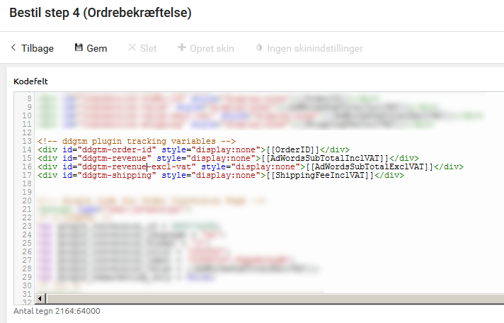

A Javascript Library for Google Tag Manager on Dandomain
===
Because of the fact that we cannot manipulate server side code on Dandomain we can't populate dataLayer variables before the DOM loads.

Implementation
===
The script presumes that you use the default Dandomain product numbering scheme which is [number]-[variant]. If you use another scheme, you have to implement the method ddgtm.parseProductNumber().

Insert the following tags on the checkout success page (Design > Tekster/knapper > Bestil step 4 (Ordrebekræftelse))

```html
<!-- Transaction tracking variables -->
<div id="ddgtm-order-id" style="display:none">[[OrderID]]</div>
<div id="ddgtm-revenue" style="display:none">[[AdWordsSubTotalInclVAT]]</div>
<div id="ddgtm-revenue-excl-vat" style="display:none">[[AdWordsSubTotalExclVAT]]</div>
<div id="ddgtm-shipping" style="display:none">[[ShippingFeeInclVAT]]</div>
```



Insert the following tags on the product template
<div style="display:none">[[Manufactors]]</div>
<div id="ddgtm-category" style="display:none">[[ProdCatName]]</div>

Insert the following tags on the product list template
<div style="display:none" class="brand">[[Manufactors]]</div>